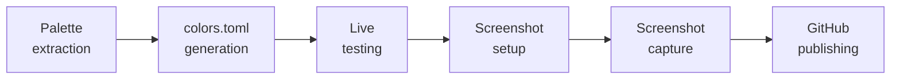

<!-- PROJECT SHIELDS -->
<div align="center">

&nbsp;&nbsp;

[![Claude Code Plugin][claude-shield]][claude-url]
[![License: MIT][license-shield]][license-url]
[![GitHub Stars][stars-shield]][stars-url]

</div>

<div align="center">

# omarchy-theme

**Desktop theme generator for [Omarchy](https://github.com/nicholasgasior/omarchy) powered by [Claude Code](https://claude.com/claude-code)**

Pick a wallpaper. Get a complete theme — palette, colors.toml, preview screenshot, GitHub repo — in one conversation.

</div>

---

## Why

Building an Omarchy theme by hand means extracting a palette, mapping colors to 22 slots, testing the result, taking a screenshot, and publishing. It's fiddly, repetitive, and easy to get wrong. This plugin turns it into a guided conversation where you pick the wallpaper and Claude handles the rest.

## Features

- **Wallpaper to theme in one command** — extract a palette, generate a 22-slot colors.toml, test it live, screenshot it, publish it
- **Natural language** — "Make me a dark theme from this forest wallpaper" just works
- **Guided workflow with checkpoints** — review colors before applying, arrange windows before screenshotting, confirm before publishing
- **Multiple wallpapers per theme** — switch wallpapers and re-extract without starting over
- **Safe by design** — all work happens in a workshop directory, never writes directly to system theme configs
- **One-click publishing** — finalize pushes to GitHub and gives you an install URL

---

## Getting Started

> [!IMPORTANT]
> Requires [Omarchy](https://github.com/nicholasgasior/omarchy) desktop environment and [Claude Code](https://claude.com/claude-code) with plugin marketplace support.

### Install

```
/plugin marketplace add tretuttle/AI-Stuff
/plugin install omarchy-theme@ai-stuff
```

Dependencies (hellwal, tint) are installed automatically via setup hook.

### Create Your First Theme

```
/theme-create midnight-forest --image ~/wallpapers/forest.png
```

Or just describe what you want:

```
"Create a theme called midnight-forest from this wallpaper"
```

---

## Usage

### /theme-create

```
/theme-create <name> [--image <path|url|random>] [--mode dark|light] [--vibe <description>]
```

| Flag | Description |
|------|-------------|
| `<name>` | Theme name (required) |
| `--image` | Wallpaper source — local path, URL, or `random` |
| `--mode` | `dark` or `light` palette extraction |
| `--vibe` | Description to guide color choices (e.g., "warm", "cyberpunk") |

**Examples:**

```
/theme-create midnight-forest --image ~/wallpapers/forest.png
/theme-create ocean-breeze --image random --mode dark
/theme-create sunset-glow --image https://example.com/sunset.jpg --vibe warm
```

### /theme-finalize

```
/theme-finalize <name> [--skip-screenshot]
```

Captures a preview screenshot, publishes to GitHub, and provides an install URL.

---

## Workflow

The plugin guides you through theme creation with checkpoints at each stage:



1. **Palette extraction** — Review extracted colors from your wallpaper
2. **colors.toml generation** — Review the 22-slot color assignments
3. **Live testing** — Apply the theme with `omarchy-theme-set` and see it on your desktop
4. **Screenshot setup** — Opens showcase apps (terminal, file manager) on workspace 9 without closing your existing windows
5. **Screenshot capture** — Arrange windows, then capture preview.png
6. **GitHub publishing** — Creates a repo with your theme and gives you an install URL

## Safety

- All work happens in `~/omarchy-theme-workshop/<name>/`
- Never writes directly to `~/.config/omarchy/themes/`
- Install only via GitHub + `omarchy-theme-install`
- PreToolUse hook blocks any Write/Edit to system theme directories

<details>
<summary><strong>Dependencies</strong></summary>

**Automatically installed by setup hook:**
- **hellwal** — Palette extraction (installed via `omarchy-pkg-aur-add`)
- **tint** — Image recoloring (bundled binary downloaded to plugin's bin/)

**Expected on Omarchy (no action needed):**
- **grim** — Screenshot capture
- **gh** — GitHub CLI for publishing
- **kitty** — Terminal (or your configured terminal)
- **thunar** — File manager

</details>

<details>
<summary><strong>Optional: Auto-approve commands</strong></summary>

To skip confirmation prompts for theme commands, add to your project's `.claude/settings.local.json`:

```json
{
  "permissions": {
    "allow": [
      "Bash(omarchy-theme-set:*)",
      "Bash(hellwal:*)",
      "Bash(grim:*)",
      "Bash(gh repo create:*)"
    ]
  }
}
```

</details>

---

---

<div align="center">

<a href="https://claude.com/claude-code"></a>
&nbsp;&nbsp;

&nbsp;&nbsp;


</div>

---

## License

MIT

<!-- LINKS -->
[claude-shield]: https://img.shields.io/badge/Claude_Code-Plugin-blueviolet?logo=anthropic&logoColor=white
[claude-url]: https://claude.com/claude-code
[license-shield]: https://img.shields.io/badge/License-MIT-green.svg
[license-url]: https://github.com/tretuttle/AI-Stuff/blob/master/LICENSE
[stars-shield]: https://img.shields.io/github/stars/tretuttle/AI-Stuff?style=social
[stars-url]: https://github.com/tretuttle/AI-Stuff/stargazers
