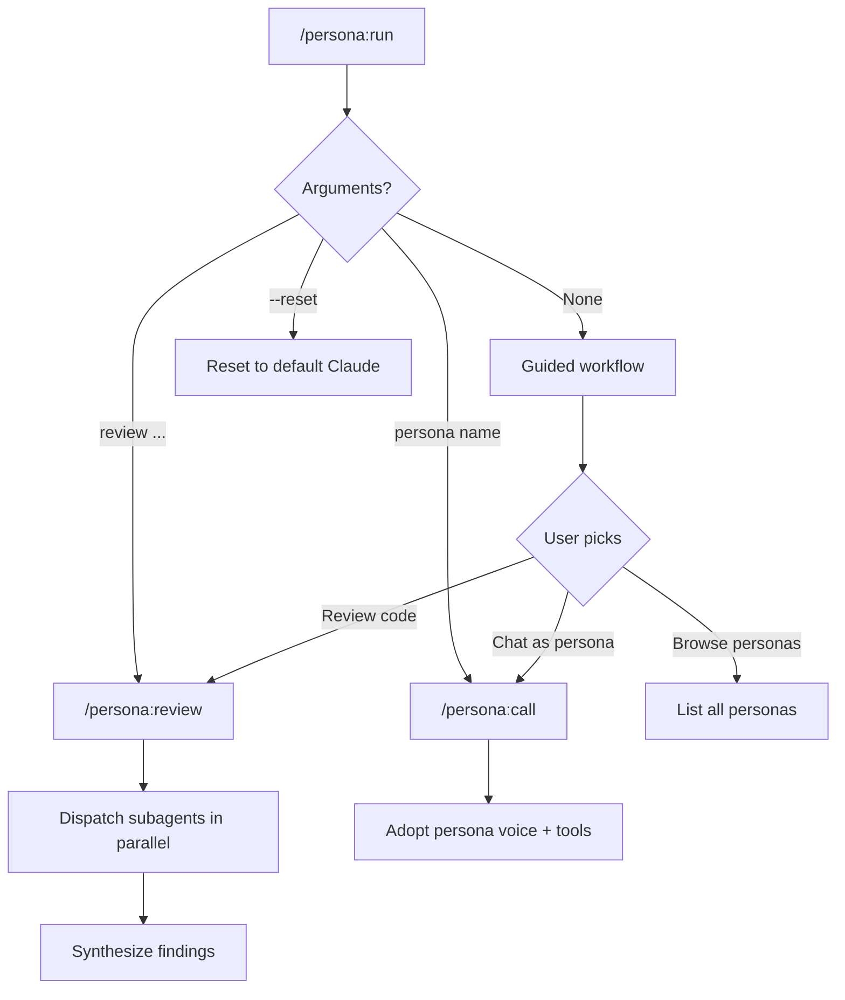

<!-- PROJECT SHIELDS -->
<div align="center">

&nbsp;&nbsp;

[![Claude Code Plugin][claude-shield]][claude-url]
[![License: MIT][license-shield]][license-url]
[![GitHub Pull Requests][pr-shield]][pr-url]
[![GitHub Issues][issues-shield]][issues-url]
[![GitHub Stars][stars-shield]][stars-url]

</div>

<!-- SHARE -->
<div align="center">

[](https://x.com/intent/tweet?text=Check%20out%20Persona%20%E2%80%94%20multi-persona%20code%20review%20for%20Claude%20Code.%20ThePrimeagen%2C%20DHH%2C%20Rich%20Harris%20and%20more%20review%20your%20code%20in%20parallel.&url=https%3A%2F%2Fgithub.com%2Ftretuttle%2FAI-Stuff)
[](https://www.reddit.com/submit?title=Persona%20%E2%80%94%20multi-persona%20code%20review%20for%20Claude%20Code&url=https%3A%2F%2Fgithub.com%2Ftretuttle%2FAI-Stuff)
[](https://news.ycombinator.com/submitlink?u=https%3A%2F%2Fgithub.com%2Ftretuttle%2FAI-Stuff&t=Persona%20%E2%80%94%20multi-persona%20code%20review%20for%20Claude%20Code)

</div>

<!-- TITLE & DESCRIPTION -->
<div align="center">

# Persona

<p>
  <a href="https://github.com/tretuttle/AI-Stuff">
    
  </a>
</p>

**Multi-persona code review and interactive dev chat for [Claude Code](https://claude.com/claude-code)**

</div>

---

## Why

A single reviewer catches what they know to look for. A performance engineer spots the blocking call but misses the accessibility gap. A testing advocate flags missing coverage but doesn't notice the bundle size doubled.

Persona gives you multiple expert perspectives in one command — each applying their principles to YOUR codebase, in YOUR language, with YOUR framework. They don't tell you to switch stacks. They tell you what's wrong with how you're using the one you chose.

## Features

- **Multiple expert perspectives** — ThePrimeagen, DHH, Rich Harris, Dan Abramov, and more review your code simultaneously, each through their unique philosophical lens
- **Principle-based, not stack-specific** — Personas apply transferable beliefs (simplicity, performance, composition, testing) to whatever codebase they're invoked in
- **Unified findings** — Duplicates merged, agreement boosts confidence, disagreements surfaced with both positions
- **Interactive persona chat** — Channel any persona for pair programming, architecture discussions, or code walkthroughs with full tool access
- **Guided workflow** — `/persona:run` walks you through everything. Power users can go direct.
- **Extensible** — Drop a new `.md` file in `agents/` and it's automatically available
- **Project memory** — Personas accumulate project-specific insights across sessions

> [!TIP]
> **Always opinionated.** Full intensity by default. These are the most polarizing developers on the internet, stereotyped on purpose. That's the product.

---

## Getting Started

> [!IMPORTANT]
> Requires [Claude Code](https://claude.com/claude-code) with plugin marketplace support.

### Install

```
/plugin marketplace add tretuttle/AI-Stuff
/plugin install persona@ai-stuff
```

### Your First Time

```
/persona:run
```

The guided workflow walks you through your options: review code, chat as a persona, or browse who's available. It remembers your preferences.

### Quick Start (if you already know what you want)

```bash
/persona:review src/auth.ts              # Review a file with all personas
/persona:review --only theprimeagen,dhh  # Just these two
/persona:call theprimeagen               # Chat as ThePrimeagen
```

---

## Demo

### Multi-Persona Review

```
/persona:run review src/auth.ts
```

```
Personas: ThePrimeagen, DHH, Chris Coyier, Dan Abramov, Evan You, ...
Target: src/auth.ts

## Persona Review Synthesis

**14 personas reviewed `src/auth.ts`**
**Summary: 2 critical, 4 warnings, 7 suggestions** (after deduplication)

### Critical (2)

#### 1. Synchronous bcrypt blocks event loop
- **Confidence:** 85 (boosted — flagged by 2 personas)
- **File:** src/auth.ts:42
- **Flagged by:** ThePrimeagen (85), DHH (75)

#### 2. No rate limiting on login endpoint
- **Confidence:** 70
- **File:** src/auth.ts:12
- **Flagged by:** Kent C. Dodds (70)

### Disagreements (1)

#### 1. [src/auth.ts] JWT vs session-based auth
- **ThePrimeagen** (warning, 70): "JWT is fine, just cache the secret"
- **DHH** (suggestion, 65): "Sessions with httpOnly cookies. JWT is almost always wrong."
```

### Interactive Persona Chat

```
/persona:call theprimeagen

> ThePrimeagen here. Show me the code. Let's see how fast this thing actually is.

You: Look at src/utils/cache.ts — is this cache implementation good?

> *reads file* Oh no. OH NO. You're using Map as a cache with no eviction
> policy. This thing grows unbounded. Every request adds an entry and NOTHING
> removes them. This is a memory leak wearing a trench coat. Use an LRU cache.
> WeakMap if the keys are objects. Or just use Redis like a normal person.

/persona:run --reset
> Back to default Claude.
```

---

## Commands

### How commands route



### /persona:run

The main entry point. Guided when called without arguments, direct when called with them.

```
/persona:run                           # Guided — walks you through it
/persona:run review src/auth.ts        # Direct — review a file
/persona:run theprimeagen              # Direct — chat as a persona
/persona:run --reset                   # Reset persona chat mode
```

### /persona:review

Power-user shortcut. Goes straight to multi-persona review.

```
/persona:review [target] [--only name1,name2] [--min-confidence N]
```

| Flag | Description |
|------|-------------|
| `[target]` | File, directory, or glob. Defaults to staged changes. |
| `--only` | Only dispatch these personas. |
| `--min-confidence N` | Hide findings below this score (default: 30). Critical findings always shown. |

### /persona:call

Power-user shortcut. Goes straight to interactive persona chat.

```
/persona:call theprimeagen       # Channel ThePrimeagen
/persona:call "Rich Harris"      # Display names work too
/persona:call --reset            # Return to default Claude
```

---

## The Personas

Each persona applies their principles to whatever codebase you're working in. They don't recommend switching your stack — they tell you what's wrong with how you're using it, through the lens of what they believe about software.

Inspired by these developers' public writing, talks, and recurring opinions.[^1]

<details>
<summary><strong>14 personas available — click to see all</strong></summary>

| Persona | Focus | Philosophy |
|---------|-------|------------|
| **ThePrimeagen** | Performance, allocations, fundamentals | Know what the machine is actually doing |
| **DHH** | Over-engineering, complexity, simplicity | You don't need that |
| **Chris Coyier** | Platform capabilities, semantic HTML, craft | The platform can do that |
| **Dan Abramov** | Mental models, composition, side effects | Understand the problem before the solution |
| **Evan You** | API design, reactivity, tooling ergonomics | It should just work |
| **Kent C. Dodds** | Testing, accessibility, web standards | Test behavior, not implementation |
| **Lee Robinson** | DX-to-UX pipeline, server-first, performance | The framework should disappear |
| **Matt Mullenweg** | Open source, backward compat, user freedom | Decisions, not options |
| **Matt Pocock** | Type safety, generics, developer experience | Types are developer experience |
| **Rich Harris** | Build-time optimization, less code, HTML-first | Do work at build time, not runtime |
| **Scott Tolinski** | CSS mastery, less boilerplate, shipping | Less ceremony, more building |
| **Tanner Linsley** | Caching, headless UI, type inference | Server state is not client state |
| **Theo Browne** | Type safety, shipping speed, pragmatism | Ship it, then iterate |
| **Wes Bos** | Readability, naming, platform features | A beginner should be able to read this |

</details>

[Create your own &#8594;](docs/CUSTOM-PERSONAS.md)

---

## Limitations

- **Token cost scales with persona count.** Each persona is a separate subagent. Use `--only` to control costs.
- **Requires Claude Code** with plugin marketplace support. Not a standalone tool.
- **Memory accumulates.** Persona memory in `.claude/agent-memory/` may need occasional cleanup.
- **Personas are read-only in review mode.** `/persona:call` gives full tool access.
- **Works with any language and framework.** Personas apply principles universally — they're not JavaScript-specific.

---

## FAQ

<details>
<summary><strong>How many personas can I run at once?</strong></summary>

All of them. Use `--only` to narrow down.
</details>

<details>
<summary><strong>Does this cost more?</strong></summary>

Yes. Each persona is a separate subagent. Use `--only` to control costs.
</details>

<details>
<summary><strong>Can personas modify my code?</strong></summary>

In review mode, no. In chat mode (`/persona:call`), yes.
</details>

<details>
<summary><strong>Works with Python / Go / Rust / etc?</strong></summary>

Yes. The personas' principles apply to any language and framework.
</details>

<details>
<summary><strong>What's the difference between review and call?</strong></summary>

Review dispatches read-only subagents that return structured findings. Call makes Claude adopt a persona's voice with full capabilities for interactive conversation.
</details>

---

## Reference

- [Synthesis engine and output format](docs/SYNTHESIS.md)
- [Custom persona creation guide](docs/CUSTOM-PERSONAS.md)
- [Architecture and plugin structure](docs/ARCHITECTURE.md)

---

## Acknowledgments

- [Claude Code](https://claude.com/claude-code) by Anthropic — the plugin platform
- [ThePrimeagen](https://www.youtube.com/@ThePrimeagen), [DHH](https://dhh.dk/), [Rich Harris](https://github.com/Rich-Harris), [Dan Abramov](https://github.com/gaearon), [Evan You](https://github.com/yyx990803), [Kent C. Dodds](https://kentcdodds.com/), [Lee Robinson](https://leerob.io/), [Matt Mullenweg](https://ma.tt/), [Matt Pocock](https://www.mattpocock.com/), [Chris Coyier](https://chriscoyier.net/), [Scott Tolinski](https://scotttolinski.com/), [Tanner Linsley](https://tanstack.com/), [Theo Browne](https://t3.gg/), [Wes Bos](https://wesbos.com/) — the developers whose philosophies inspire these personas

[^1]: Persona is a fan project. The personas are inspired by these developers' public teachings, talks, and writing. It is not endorsed by or affiliated with any of the individuals named above.

---

## Feedback

Found a bug? Have a persona request? [Open an issue](https://github.com/tretuttle/AI-Stuff/issues) — include which persona and what they said (or should have said).

---

## Current Contributors

<a href="https://github.com/tretuttle/AI-Stuff/graphs/contributors">
  
</a>

---

<div align="center">

<a href="https://claude.com/claude-code"></a>
&nbsp;&nbsp;

&nbsp;&nbsp;


</div>

---

<div align="center">

**[Back to top](#persona)**

</div>

<!-- LINKS -->
[claude-shield]: https://img.shields.io/badge/Claude_Code-Plugin-blueviolet?logo=anthropic&logoColor=white
[claude-url]: https://claude.com/claude-code
[license-shield]: https://img.shields.io/badge/License-MIT-green.svg
[license-url]: https://github.com/tretuttle/AI-Stuff/blob/master/LICENSE
[pr-shield]: https://img.shields.io/github/issues-pr/tretuttle/AI-Stuff
[pr-url]: https://github.com/tretuttle/AI-Stuff/pulls
[issues-shield]: https://img.shields.io/github/issues/tretuttle/AI-Stuff
[issues-url]: https://github.com/tretuttle/AI-Stuff/issues
[stars-shield]: https://img.shields.io/github/stars/tretuttle/AI-Stuff?style=social
[stars-url]: https://github.com/tretuttle/AI-Stuff/stargazers
